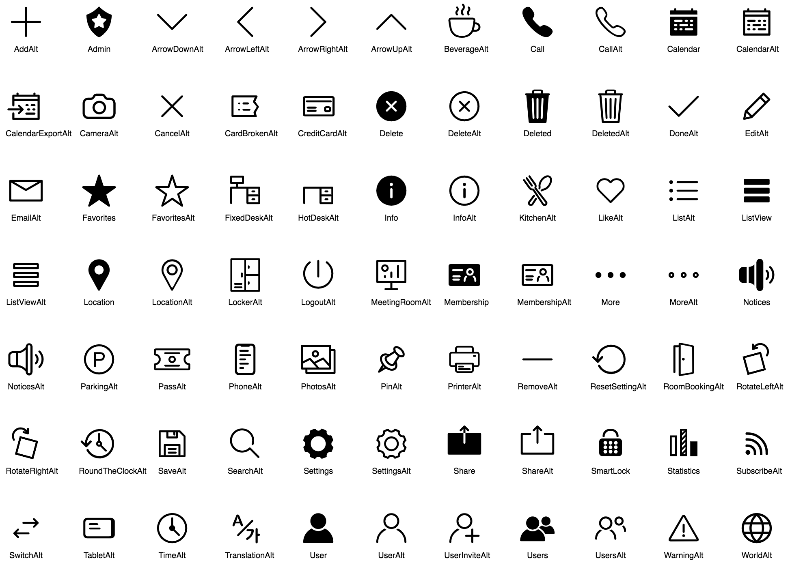
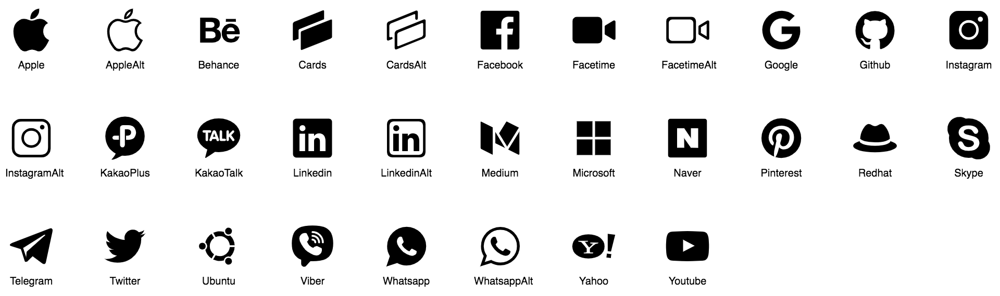
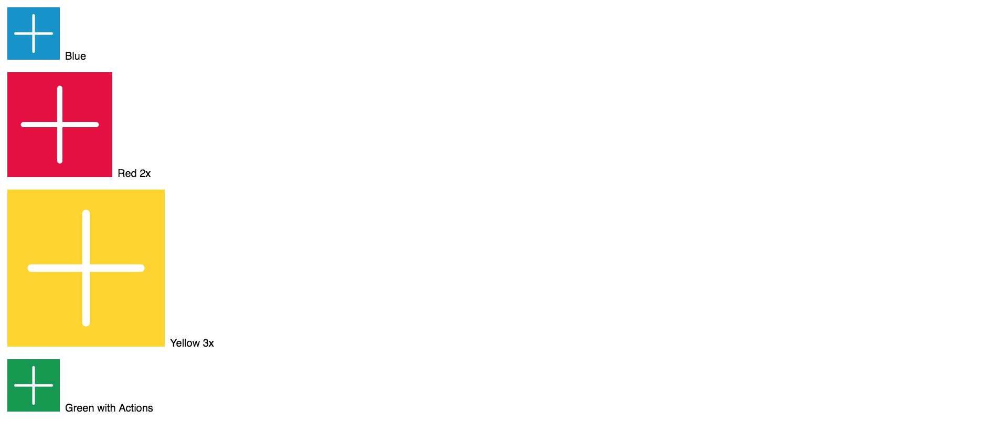

# andcards-icons-kit

[](https://greenkeeper.io/)
[](https://travis-ci.org/andcards/andcards-icons-kit)
[](https://www.npmjs.org/package/andcards-icons-kit)
[](https://david-dm.org/andcards/andcards-icons-kit)
[](https://david-dm.org/andcards/andcards-icons-kit#info=devDependencies)
[](https://david-dm.org/andcards/andcards-icons-kit#info=peerDependencies)

andCards Icons Kit for React and React Native.

Designed for:

- [andCards Suite web app](https://andcards.com).
- [andCards Suite Android app](https://play.google.com/store/apps/details?id=com.cardscorp.contacts).
- [andCards Suite iOS app](https://itunes.apple.com/us/app/andcards-suite/id1291226540?mt=8).
- [andCards Spaces web site](https://andcards.com/s).

#### General Icons



#### Brand Icons



#### Usage Examples



### Installation

```
yarn add andcards-icons-kit

// In case you don't have. Only for React Native.
yarn add react-native-svg
react-native link react-native-svg
```

### The Gist

```javascript
import Apple from "andcards-icons-kit/Apple";

<Apple color="#cccccc" size={32} />;
```

## Basic API

| prop    | type     | default value |
| ------- | -------- | ------------- |
| `color` | `string` | #000000       |
| `size`  | `number` | 20            |

## Advanced API

Check out [svgs docs](https://github.com/react-native-community/react-native-svg).

## License

MIT
